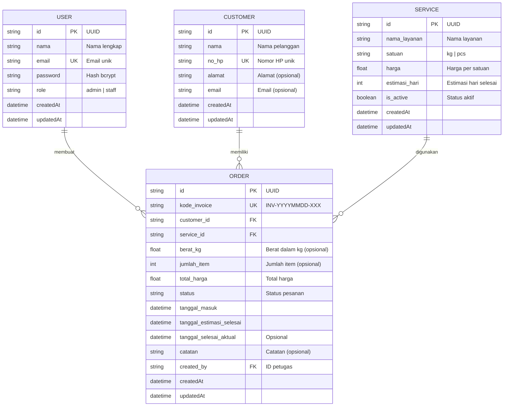
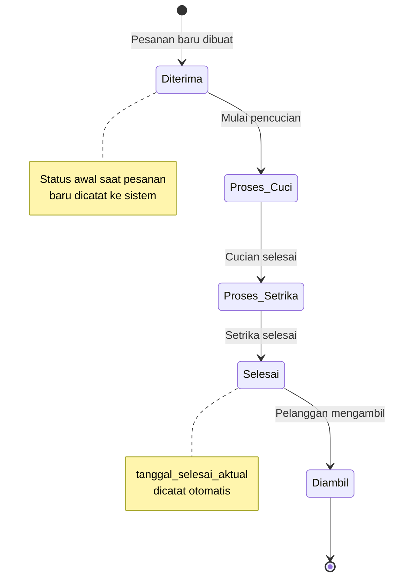
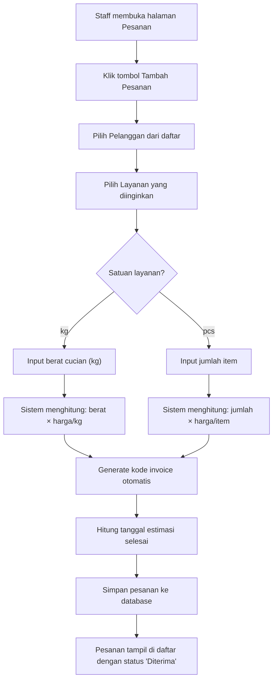

<p align="center">
  
  
  
  
  
  
  
</p>

<h1 align="center">🧺 CleanWash — Sistem Manajemen Laundry</h1>

<p align="center">
  <strong>Aplikasi web modern untuk mengelola operasional bisnis laundry secara efisien dan terintegrasi.</strong>
</p>

<p align="center">
  Dibangun menggunakan <strong>Next.js 16</strong>, <strong>Prisma ORM</strong>, dan <strong>NextAuth.js</strong> dengan antarmuka yang elegan dan responsif.
</p>

---

## 📑 Daftar Isi

- [Tentang Proyek](#-tentang-proyek)
- [Fitur Utama](#-fitur-utama)
- [Tech Stack](#-tech-stack)
- [Arsitektur & Struktur Proyek](#-arsitektur--struktur-proyek)
- [Skema Database (ERD)](#-skema-database-erd)
- [Alur Bisnis Aplikasi](#-alur-bisnis-aplikasi)
- [Prasyarat](#-prasyarat)
- [Instalasi & Setup](#-instalasi--setup)
- [Akun Default](#-akun-default)
- [Panduan Penggunaan](#-panduan-penggunaan)
- [Halaman Aplikasi](#-halaman-aplikasi)
- [Desain Sistem & Pola Arsitektur](#-desain-sistem--pola-arsitektur)
- [Materi Referensi Presentasi](#-materi-referensi-presentasi)
- [Pengembangan ke Depan (Roadmap)](#-pengembangan-ke-depan-roadmap)
- [Lisensi](#-lisensi)

---

## 📖 Tentang Proyek

### Latar Belakang

Industri laundry di Indonesia terus berkembang seiring dengan meningkatnya kebutuhan masyarakat urban akan layanan pencucian pakaian yang praktis dan efisien. Namun, banyak usaha laundry yang masih mengandalkan pencatatan manual menggunakan buku tulis atau spreadsheet sederhana, yang rentan terhadap:

- **Kesalahan pencatatan** pesanan dan pembayaran
- **Kehilangan data** pelanggan dan riwayat transaksi
- **Kesulitan pelacakan** status pesanan secara real-time
- **Ketidakefisienan** dalam mengelola layanan dan harga
- **Tidak adanya laporan bisnis** yang akurat untuk pengambilan keputusan

### Solusi

**CleanWash** hadir sebagai solusi digital berbasis web yang dirancang untuk mengatasi permasalahan tersebut. Aplikasi ini menyediakan sistem manajemen laundry yang terintegrasi, mencakup pengelolaan pelanggan, layanan, pesanan, hingga pelaporan bisnis — semuanya dalam satu platform yang mudah digunakan.

### Tujuan Pengembangan

1. **Mempermudah** proses pencatatan dan pengelolaan pesanan laundry
2. **Meningkatkan efisiensi** operasional bisnis laundry sehari-hari
3. **Menyediakan data akurat** untuk pengambilan keputusan bisnis
4. **Meningkatkan pelayanan** kepada pelanggan melalui tracking status pesanan
5. **Mengurangi kesalahan** yang terjadi pada pencatatan manual

### Target Pengguna

| Pengguna | Peran | Akses |
|---|---|---|
| **Pemilik Usaha / Admin** | Mengelola seluruh sistem | Akses penuh ke semua fitur |
| **Staff / Kasir** | Operasional harian | Mengelola pesanan & pelanggan |

---

## ✨ Fitur Utama

### 🔐 Sistem Autentikasi
- Login aman menggunakan **email dan password**
- Password terenkripsi menggunakan **bcrypt** (hash + salt)
- Session berbasis **JSON Web Token (JWT)**
- Sistem **role-based access** (Admin & Staff)
- Redirect otomatis ke halaman login jika belum terautentikasi
- Proteksi route dashboard dengan server-side session check

### 📊 Dashboard Real-time
- **Pesanan Hari Ini** — jumlah pesanan yang masuk pada hari berjalan
- **Pesanan Pending** — jumlah pesanan yang masih dalam proses (diterima, proses cuci, proses setrika)
- **Selesai Hari Ini** — jumlah pesanan yang telah selesai hari ini
- **Pendapatan Hari Ini** — total pendapatan dari pesanan hari ini (format Rupiah)
- Data statistik diambil langsung dari database secara **server-side** untuk performa optimal

### 👥 Manajemen Pelanggan
- **Tambah** pelanggan baru (nama, nomor HP, alamat, email)
- **Edit** informasi pelanggan yang sudah ada
- **Hapus** data pelanggan
- Validasi **nomor HP unik** untuk setiap pelanggan
- Pencarian dan filter pelanggan

### 🧺 Manajemen Layanan
- **Tambah** jenis layanan baru (nama layanan, satuan, harga, estimasi hari)
- **Edit** detail layanan
- **Hapus** layanan
- Pilihan satuan fleksibel: **kg** (kilogram) atau **pcs** (item/satuan)
- Status aktif/nonaktif untuk setiap layanan
- Estimasi waktu pengerjaan per layanan

### 📦 Manajemen Pesanan
- **Buat pesanan baru** dengan memilih pelanggan dan layanan
- **Kode invoice otomatis** dengan format: `INV-YYYYMMDD-XXX`
- **Perhitungan harga otomatis** berdasarkan berat (kg) atau jumlah item × harga layanan
- **Estimasi tanggal selesai otomatis** berdasarkan estimasi hari layanan
- **Tracking status pesanan** dengan 5 tahap:
  - `diterima` → `proses_cuci` → `proses_setrika` → `selesai` → `diambil`
- **Catatan tambahan** untuk setiap pesanan
- Pencatatan **petugas yang membuat pesanan** (created_by)
- **Hapus pesanan** jika diperlukan

### 🎨 Antarmuka Modern & Responsif
- Desain **glassmorphism** dengan efek blur dan transparansi
- **Animasi halus** menggunakan CSS animations dan Framer Motion
- **Responsive design** — tampil optimal di desktop, tablet, dan mobile
- **Landing page** dengan hero section yang menarik
- Navigasi intuitif dengan **navbar** dan active state indicator
- **Gradient warna** yang elegan (Primary Blue `#106EBE` + Accent Green `#0FFCBE`)
- Tipografi modern menggunakan font **Inter** dari Google Fonts

---

## 🛠 Tech Stack

### Frontend

| Teknologi | Versi | Kegunaan |
|---|---|---|
| [Next.js](https://nextjs.org/) | `16.2.10` | Framework React fullstack dengan App Router, Server Components, dan Server Actions |
| [React](https://react.dev/) | `19.2.4` | Library UI untuk membangun antarmuka pengguna interaktif |
| [TypeScript](https://www.typescriptlang.org/) | `^5` | Superset JavaScript yang menambahkan type safety |
| [Tailwind CSS](https://tailwindcss.com/) | `4` | Utility-first CSS framework untuk styling cepat dan konsisten |
| [Framer Motion](https://www.framer.com/motion/) | `12.42.2` | Library animasi deklaratif untuk React |
| [Lucide React](https://lucide.dev/) | `1.23.0` | Library ikon modern dan ringan |
| [clsx](https://github.com/lukeed/clsx) | `2.1.1` | Utilitas untuk menggabungkan className secara kondisional |
| [tailwind-merge](https://github.com/dcastil/tailwind-merge) | `3.6.0` | Menggabungkan kelas Tailwind tanpa konflik |

### Backend

| Teknologi | Versi | Kegunaan |
|---|---|---|
| [Next.js API / Server Actions](https://nextjs.org/) | `16.2.10` | Server-side logic dengan `"use server"` directive |
| [Prisma ORM](https://www.prisma.io/) | `5.22.0` | ORM modern untuk akses database type-safe |
| [SQLite](https://www.sqlite.org/) | - | Database relasional ringan berbasis file (zero-configuration) |
| [NextAuth.js](https://next-auth.js.org/) | `4.24.14` | Solusi autentikasi lengkap untuk Next.js |
| [bcrypt](https://www.npmjs.com/package/bcrypt) | `6.0.0` | Library hashing password dengan algoritma bcrypt |
| [Zod](https://zod.dev/) | `4.4.3` | Library validasi schema TypeScript-first |
| [React Hook Form](https://react-hook-form.com/) | `7.80.0` | Library manajemen form yang performant |
| [date-fns](https://date-fns.org/) | `4.4.0` | Library utilitas manipulasi tanggal JavaScript modern |

### Alasan Pemilihan Teknologi

- **Next.js 16 + App Router** — Memanfaatkan fitur terbaru seperti Server Components untuk rendering server-side yang optimal, Server Actions untuk mutasi data tanpa API endpoint terpisah, dan built-in routing berbasis filesystem
- **Prisma + SQLite** — Kombinasi ORM type-safe dengan database ringan tanpa konfigurasi server terpisah. Ideal untuk skala kecil-menengah dan development cepat
- **NextAuth.js** — Solusi autentikasi yang mature dan terintegrasi sempurna dengan ekosistem Next.js, mendukung JWT session strategy
- **Tailwind CSS v4** — Versi terbaru dengan performa lebih baik dan konfigurasi CSS-native, mengurangi boilerplate konfigurasi

---

## 🏗 Arsitektur & Struktur Proyek

### Diagram Arsitektur

```
┌──────────────────────────────────────────────────────────────┐
│                      BROWSER (Client)                        │
│  ┌─────────────┐  ┌─────────────┐  ┌─────────────────────┐  │
│  │  Landing     │  │  Login      │  │  Dashboard          │  │
│  │  Page        │  │  Page       │  │  (Customers/         │  │
│  │             │  │             │  │   Services/Orders)   │  │
│  └──────┬──────┘  └──────┬──────┘  └──────────┬──────────┘  │
└─────────┼────────────────┼─────────────────────┼─────────────┘
          │                │                     │
          ▼                ▼                     ▼
┌──────────────────────────────────────────────────────────────┐
│                    NEXT.JS SERVER                            │
│  ┌─────────────────┐  ┌──────────────────────────────────┐  │
│  │  Server          │  │  Server Actions                  │  │
│  │  Components      │  │  (createOrder, updateStatus,     │  │
│  │  (SSR Pages)     │  │   createCustomer, etc.)          │  │
│  └────────┬─────────┘  └───────────────┬──────────────────┘  │
│           │                            │                     │
│  ┌────────┴────────────────────────────┴──────────────────┐  │
│  │              NextAuth.js (JWT Authentication)          │  │
│  └────────────────────────┬───────────────────────────────┘  │
│                           │                                  │
│  ┌────────────────────────┴───────────────────────────────┐  │
│  │                   Prisma ORM (Type-safe)               │  │
│  └────────────────────────┬───────────────────────────────┘  │
└───────────────────────────┼──────────────────────────────────┘
                            │
                            ▼
                  ┌───────────────────┐
                  │   SQLite Database  │
                  │   (dev.db file)    │
                  └───────────────────┘
```

### Struktur Folder

```
cleanwash/
├── prisma/                          # Konfigurasi Database
│   ├── schema.prisma                # Definisi model & relasi database
│   ├── seed.ts                      # Data awal (admin, staff, layanan, pelanggan)
│   ├── dev.db                       # File database SQLite
│   └── migrations/                  # Riwayat migrasi database
│       └── 20260704085138_init/     # Migrasi awal
│
├── public/                          # Aset statis
│   └── images/                      # Gambar hero, fitur, dan pattern
│       ├── hero-laundry.png         # Gambar hero landing page
│       ├── feature-washing.png      # Gambar fitur pencucian
│       ├── feature-folding.png      # Gambar fitur setrika & lipat
│       ├── feature-fast.png         # Gambar fitur layanan cepat
│       ├── hero-customers.png       # Gambar hero halaman pelanggan
│       ├── hero-services.png        # Gambar hero halaman layanan
│       ├── hero-orders.png          # Gambar hero halaman pesanan
│       └── bg-pattern.png           # Background pattern
│
├── src/
│   ├── app/                         # App Router (Pages & API)
│   │   ├── layout.tsx               # Root layout (font, providers, metadata)
│   │   ├── page.tsx                 # Landing page + dashboard statistik
│   │   ├── globals.css              # Variabel CSS & tema warna kustom
│   │   ├── template.tsx             # Template animasi transisi halaman
│   │   │
│   │   ├── login/                   # Modul Autentikasi
│   │   │   ├── page.tsx             # Halaman login (server-side redirect)
│   │   │   └── login-form.tsx       # Komponen form login (client-side)
│   │   │
│   │   ├── dashboard/               # Modul Dashboard (Protected)
│   │   │   ├── layout.tsx           # Layout dashboard (auth guard)
│   │   │   ├── template.tsx         # Template animasi dashboard
│   │   │   │
│   │   │   ├── customers/           # Sub-modul Pelanggan
│   │   │   │   ├── page.tsx         # Halaman daftar pelanggan (SSR)
│   │   │   │   ├── customer-client.tsx  # UI interaktif CRUD pelanggan
│   │   │   │   └── actions.ts       # Server actions (create/update/delete)
│   │   │   │
│   │   │   ├── services/            # Sub-modul Layanan
│   │   │   │   ├── page.tsx         # Halaman daftar layanan (SSR)
│   │   │   │   ├── service-client.tsx   # UI interaktif CRUD layanan
│   │   │   │   └── actions.ts       # Server actions (create/update/delete)
│   │   │   │
│   │   │   └── orders/              # Sub-modul Pesanan
│   │   │       ├── page.tsx         # Halaman daftar pesanan (SSR)
│   │   │       ├── order-client.tsx # UI interaktif CRUD pesanan
│   │   │       └── actions.ts       # Server actions (create/update/delete)
│   │   │
│   │   └── api/                     # API Routes
│   │       └── auth/
│   │           └── [...nextauth]/   # NextAuth.js catch-all route
│   │
│   ├── components/                  # Komponen Reusable
│   │   ├── navbar.tsx               # Navigasi utama (responsive)
│   │   ├── sidebar.tsx              # Sidebar navigasi (desktop)
│   │   ├── topbar.tsx               # Top bar dengan info user & logout
│   │   └── providers.tsx            # Session provider wrapper
│   │
│   ├── lib/                         # Library & Utilitas
│   │   ├── auth.ts                  # Konfigurasi NextAuth (providers, callbacks)
│   │   └── prisma.ts               # Singleton instance Prisma Client
│   │
│   └── types/                       # Definisi Tipe
│       └── next-auth.d.ts           # Augmentasi tipe NextAuth (role)
│
├── .env                             # Variabel lingkungan (DATABASE_URL)
├── package.json                     # Dependensi & skrip npm
├── tsconfig.json                    # Konfigurasi TypeScript
├── next.config.ts                   # Konfigurasi Next.js
├── postcss.config.mjs               # Konfigurasi PostCSS (Tailwind)
└── eslint.config.mjs                # Konfigurasi ESLint
```

---

## 🗄 Skema Database (ERD)

### Entity Relationship Diagram



### Penjelasan Relasi

| Relasi | Tipe | Deskripsi |
|---|---|---|
| `User` → `Order` | One-to-Many | Satu user (petugas) dapat membuat banyak pesanan |
| `Customer` → `Order` | One-to-Many | Satu pelanggan dapat memiliki banyak pesanan |
| `Service` → `Order` | One-to-Many | Satu layanan dapat digunakan di banyak pesanan |

### Detail Field Tabel

#### Tabel `User` — Data Pengguna Sistem
| Field | Tipe | Constraint | Deskripsi |
|---|---|---|---|
| `id` | String | PK, UUID | Identitas unik pengguna |
| `nama` | String | Required | Nama lengkap pengguna |
| `email` | String | Unique | Alamat email untuk login |
| `password` | String | Required | Password ter-hash (bcrypt) |
| `role` | String | Default: `"staff"` | Role pengguna: `admin` atau `staff` |
| `createdAt` | DateTime | Auto | Waktu pembuatan akun |
| `updatedAt` | DateTime | Auto | Waktu terakhir update |

#### Tabel `Customer` — Data Pelanggan
| Field | Tipe | Constraint | Deskripsi |
|---|---|---|---|
| `id` | String | PK, UUID | Identitas unik pelanggan |
| `nama` | String | Required | Nama lengkap pelanggan |
| `no_hp` | String | Unique | Nomor HP pelanggan |
| `alamat` | String | Optional | Alamat pelanggan |
| `email` | String | Optional | Email pelanggan |
| `createdAt` | DateTime | Auto | Waktu pendaftaran |
| `updatedAt` | DateTime | Auto | Waktu terakhir update |

#### Tabel `Service` — Data Layanan Laundry
| Field | Tipe | Constraint | Deskripsi |
|---|---|---|---|
| `id` | String | PK, UUID | Identitas unik layanan |
| `nama_layanan` | String | Required | Nama layanan (misal: Cuci Kering) |
| `satuan` | String | Default: `"kg"` | Satuan: `kg` atau `pcs` |
| `harga` | Float | Required | Harga per satuan (Rupiah) |
| `estimasi_hari` | Int | Default: `2` | Estimasi hari pengerjaan |
| `is_active` | Boolean | Default: `true` | Status aktif layanan |
| `createdAt` | DateTime | Auto | Waktu pembuatan |
| `updatedAt` | DateTime | Auto | Waktu terakhir update |

#### Tabel `Order` — Data Pesanan
| Field | Tipe | Constraint | Deskripsi |
|---|---|---|---|
| `id` | String | PK, UUID | Identitas unik pesanan |
| `kode_invoice` | String | Unique | Kode invoice otomatis |
| `customer_id` | String | FK → Customer | Referensi pelanggan |
| `service_id` | String | FK → Service | Referensi layanan |
| `berat_kg` | Float | Optional | Berat cucian (untuk satuan kg) |
| `jumlah_item` | Int | Optional | Jumlah item (untuk satuan pcs) |
| `total_harga` | Float | Required | Total harga pesanan |
| `status` | String | Default: `"diterima"` | Status tracking pesanan |
| `tanggal_masuk` | DateTime | Auto | Tanggal pesanan masuk |
| `tanggal_estimasi_selesai` | DateTime | Required | Tanggal estimasi selesai |
| `tanggal_selesai_aktual` | DateTime | Optional | Tanggal selesai aktual |
| `catatan` | String | Optional | Catatan tambahan |
| `created_by` | String | FK → User | Petugas yang membuat pesanan |
| `createdAt` | DateTime | Auto | Waktu pembuatan record |
| `updatedAt` | DateTime | Auto | Waktu terakhir update |

---

## 🔄 Alur Bisnis Aplikasi

### Alur Status Pesanan



### Alur Pembuatan Pesanan



### Format Kode Invoice

Kode invoice di-generate secara otomatis dengan format:

```
INV-YYYYMMDD-XXX
```

| Bagian | Keterangan | Contoh |
|---|---|---|
| `INV` | Prefix tetap | `INV` |
| `YYYYMMDD` | Tanggal pesanan | `20260710` |
| `XXX` | Nomor urut harian (3 digit) | `001`, `002`, `015` |

**Contoh**: `INV-20260710-003` → Pesanan ke-3 pada tanggal 10 Juli 2026

### Perhitungan Harga

```
Jika satuan = "kg":
    total_harga = berat_kg × harga_per_kg

Jika satuan = "pcs":
    total_harga = jumlah_item × harga_per_item
```

**Contoh Perhitungan:**

| Layanan | Satuan | Harga | Input | Total |
|---|---|---|---|---|
| Cuci Kering | kg | Rp 6.000 | 3.5 kg | Rp 21.000 |
| Cuci Setrika | kg | Rp 8.000 | 5 kg | Rp 40.000 |

---

## 📋 Prasyarat

Pastikan perangkat Anda telah terinstal software berikut:

| Software | Versi Minimum | Keterangan |
|---|---|---|
| [Node.js](https://nodejs.org/) | `18.x` atau lebih baru | Runtime JavaScript |
| [npm](https://www.npmjs.com/) | `9.x` atau lebih baru | Package manager (sudah termasuk di Node.js) |
| [Git](https://git-scm.com/) | Terbaru | Version control system |

> **Catatan:** SQLite tidak perlu diinstal secara terpisah karena sudah ditangani oleh Prisma.

---

## 🚀 Instalasi & Setup

### 1. Clone Repository

```bash
git clone https://github.com/madrianalghifari-dev/UAS-4dr.git
cd UAS-4dr
```

### 2. Install Dependensi

```bash
npm install
```

### 3. Konfigurasi Environment

Buat file `.env` di root proyek (jika belum ada):

```env
# URL database SQLite
DATABASE_URL="file:./dev.db"

# Secret untuk NextAuth.js (ganti dengan string acak yang kuat untuk production)
NEXTAUTH_SECRET="supersecretlaundryapp2026"

# URL aplikasi
NEXTAUTH_URL="http://localhost:3000"
```

### 4. Setup Database

```bash
# Generate Prisma Client
npx prisma generate

# Jalankan migrasi database
npx prisma migrate dev

# Isi data awal (seed)
npx prisma db seed
```

### 5. Jalankan Aplikasi

```bash
npm run dev
```

Buka [http://localhost:3000](http://localhost:3000) di browser Anda.

### 6. (Opsional) Lihat Database

Gunakan Prisma Studio untuk melihat dan mengelola data secara visual:

```bash
npx prisma studio
```

Buka [http://localhost:5555](http://localhost:5555) di browser Anda.

---

## 🔑 Akun Default

Setelah menjalankan `npx prisma db seed`, akun berikut akan tersedia:

| Role | Nama | Email | Password |
|---|---|---|---|
| **Admin** | Admin Utama | `admin@laundry.com` | `admin123` |
| **Staff** | Staff Kasir | `staff@laundry.com` | `staff123` |

### Data Seed Lainnya

| Data | Detail |
|---|---|
| **Layanan 1** | Cuci Kering — Rp 6.000/kg — Estimasi 2 hari |
| **Layanan 2** | Cuci Setrika — Rp 8.000/kg — Estimasi 3 hari |
| **Pelanggan 1** | Budi Santoso — HP: 081234567890 — Jl. Sudirman No. 1 |

> ⚠️ **Penting**: Untuk lingkungan production, pastikan untuk mengganti password default dan `NEXTAUTH_SECRET` dengan nilai yang kuat dan aman.

---

## 📖 Panduan Penggunaan

### 1. Login ke Sistem

1. Buka aplikasi di browser (`http://localhost:3000`)
2. Klik menu navigasi atau langsung buka `/login`
3. Masukkan **email** dan **password**
4. Sistem akan mengarahkan ke halaman utama setelah login berhasil

### 2. Melihat Dashboard

- Halaman utama (`/`) menampilkan **landing page** dengan hero section dan statistik bisnis
- Bagian **Ringkasan Bisnis Hari Ini** menampilkan 4 kartu statistik:
  - Pesanan Hari Ini
  - Pesanan Pending
  - Selesai Hari Ini
  - Pendapatan Hari Ini

### 3. Mengelola Pelanggan (`/dashboard/customers`)

| Aksi | Langkah |
|---|---|
| **Tambah** | Klik tombol "Tambah Pelanggan" → Isi form → Simpan |
| **Edit** | Klik ikon edit pada baris pelanggan → Ubah data → Simpan |
| **Hapus** | Klik ikon hapus → Konfirmasi penghapusan |

### 4. Mengelola Layanan (`/dashboard/services`)

| Aksi | Langkah |
|---|---|
| **Tambah** | Klik tombol "Tambah Layanan" → Isi nama, satuan, harga, estimasi → Simpan |
| **Edit** | Klik ikon edit → Ubah detail layanan → Simpan |
| **Hapus** | Klik ikon hapus → Konfirmasi penghapusan |

### 5. Mengelola Pesanan (`/dashboard/orders`)

| Aksi | Langkah |
|---|---|
| **Buat Pesanan** | Klik "Tambah Pesanan" → Pilih pelanggan → Pilih layanan → Input berat/jumlah → Simpan |
| **Update Status** | Klik tombol status pada pesanan → Pilih status berikutnya |
| **Hapus** | Klik ikon hapus → Konfirmasi penghapusan |

---

## 🖥 Halaman Aplikasi

### 1. Landing Page (`/`)
Halaman utama publik yang menampilkan:
- **Hero Section** — Background gambar laundry dengan overlay gradient, headline, dan CTA button
- **Fitur Section** — 3 kartu fitur unggulan (Pencucian Berkualitas, Setrika & Lipat Rapi, Layanan Cepat & Ramah)
- **Dashboard Section** — Ringkasan statistik bisnis hari ini dengan 4 kartu informasi

### 2. Halaman Login (`/login`)
- Form login minimalis dengan desain **glassmorphism**
- Logo CleanWash dengan ikon Droplets
- Field email dan password dengan validasi
- Error handling untuk kredensial yang salah
- Loading spinner saat proses autentikasi

### 3. Dashboard Pelanggan (`/dashboard/customers`)
- Hero section dengan gambar dan judul halaman
- Tabel daftar semua pelanggan
- Modal/form untuk tambah dan edit pelanggan
- Tombol aksi (edit, hapus) pada setiap baris
- Server-side data fetching untuk performa optimal

### 4. Dashboard Layanan (`/dashboard/services`)
- Hero section dengan gambar dan judul halaman
- Grid/tabel daftar layanan dengan info harga dan estimasi
- Modal/form untuk manajemen layanan
- Indikator status aktif/nonaktif
- Server-side data fetching

### 5. Dashboard Pesanan (`/dashboard/orders`)
- Hero section dengan gambar dan judul halaman
- Tabel daftar pesanan dengan kode invoice dan status
- Badge warna untuk setiap status pesanan
- Modal/form pembuatan pesanan baru
- Dropdown update status pesanan
- Informasi pelanggan dan layanan terintegrasi
- Server-side data fetching

---

## 🧩 Desain Sistem & Pola Arsitektur

### Pola yang Digunakan

#### 1. Server Components (Default)
Semua halaman di-render secara **server-side** secara default. Data diambil langsung di komponen server menggunakan Prisma, menghilangkan kebutuhan API endpoint terpisah.

```tsx
// Contoh: page.tsx mengambil data langsung di server
export default async function CustomersPage() {
  const customers = await prisma.customer.findMany();
  return <CustomerClient customers={customers} />;
}
```

#### 2. Server Actions untuk Mutasi Data
Operasi CRUD (Create, Read, Update, Delete) menggunakan **Server Actions** dengan directive `"use server"`. Ini menghilangkan kebutuhan untuk membuat API route terpisah.

```tsx
// Contoh: actions.ts
"use server";
export async function createCustomer(data) {
  await prisma.customer.create({ data });
  revalidatePath("/dashboard/customers");
}
```

#### 3. Client Components untuk Interaktivitas
Komponen yang membutuhkan interaktivitas pengguna (form, modal, event handler) menggunakan directive `"use client"`.

#### 4. Authentication Guard
Dashboard dilindungi oleh **server-side session check** di `layout.tsx`:

```tsx
const session = await getServerSession(authOptions);
if (!session) redirect("/login");
```

### Tema Warna Kustom

Aplikasi menggunakan sistem warna kustom yang didefinisikan di `globals.css`:

| Variabel | Warna | Hex | Kegunaan |
|---|---|---|---|
| `--color-primary` | 🔵 Biru | `#106EBE` | Warna utama (branding, tombol, link) |
| `--color-primary-hover` | 🔵 Biru Gelap | `#0D5C9E` | Hover state warna utama |
| `--color-accent` | 🟢 Hijau Mint | `#0FFCBE` | Warna aksen (highlight, gradient) |
| `--color-accent-hover` | 🟢 Hijau Gelap | `#0DE5AC` | Hover state warna aksen |
| `--color-surface` | ⬜ Abu-abu Terang | `#F4F6F8` | Background permukaan |
| `--color-text-main` | ⬛ Abu-abu Gelap | `#33383F` | Warna teks utama |
| `--color-danger` | 🔴 Merah | `#E5484D` | Warna peringatan/hapus |
| `--color-warning` | 🟡 Kuning | `#F5A623` | Warna peringatan/pending |

---

## 🎓 Materi Referensi Presentasi

Bagian ini berisi poin-poin ringkas yang dapat digunakan sebagai referensi untuk membuat slide presentasi.

---

### 📌 Slide 1: Judul

```
Judul    : CleanWash — Sistem Manajemen Laundry Berbasis Web
Subtitle : Ujian Akhir Semester (UAS)
Teknologi: Next.js 16 | React 19 | Prisma | SQLite | TypeScript
```

---

### 📌 Slide 2: Latar Belakang & Permasalahan

**Permasalahan yang Ditemukan:**
- Pencatatan manual rentan kesalahan dan kehilangan data
- Pelacakan status pesanan sulit dilakukan secara akurat
- Tidak ada sistem terpusat untuk mengelola data pelanggan
- Perhitungan harga dan pembuatan invoice dilakukan secara manual
- Tidak tersedia laporan bisnis real-time untuk pengambilan keputusan

---

### 📌 Slide 3: Tujuan & Manfaat

**Tujuan:**
1. Mengembangkan aplikasi web untuk manajemen operasional laundry
2. Mengotomasi pencatatan pesanan dan perhitungan harga
3. Menyediakan tracking status pesanan secara real-time
4. Membangun dashboard statistik bisnis

**Manfaat:**
- Efisiensi operasional meningkat
- Data bisnis lebih akurat dan terpusat
- Pelayanan pelanggan lebih baik
- Pengambilan keputusan berbasis data

---

### 📌 Slide 4: Tech Stack

```
Frontend  : Next.js 16, React 19, TypeScript, Tailwind CSS 4
Backend   : Next.js Server Actions, NextAuth.js 4
Database  : Prisma ORM 5.22 + SQLite
UI/UX     : Framer Motion, Lucide Icons, Glassmorphism Design
Tools     : bcrypt (enkripsi), Zod (validasi), React Hook Form, date-fns
```

---

### 📌 Slide 5: Arsitektur Sistem

**Pendekatan:** Fullstack Monolith dengan Next.js App Router

```
Client (Browser)
    ↓ HTTP Request
Next.js Server (SSR + Server Actions)
    ↓ Prisma ORM
SQLite Database (File-based)
```

**Keunggulan Arsitektur:**
- Zero-API: Server Actions menggantikan REST API tradisional
- Type-safe end-to-end: TypeScript + Prisma
- Server-side rendering untuk SEO dan performa
- Authentication terintegrasi dengan NextAuth.js (JWT)

---

### 📌 Slide 6: Skema Database (ERD)

**4 Entitas Utama:**

| Entitas | Deskripsi | Relasi |
|---|---|---|
| `User` | Pengguna sistem (admin/staff) | 1 → N Order |
| `Customer` | Data pelanggan laundry | 1 → N Order |
| `Service` | Jenis layanan yang tersedia | 1 → N Order |
| `Order` | Pesanan/transaksi laundry | N → 1 (User, Customer, Service) |

> Gunakan diagram ERD Mermaid dari bagian Skema Database di atas.

---

### 📌 Slide 7: Fitur Utama

| No | Fitur | Deskripsi |
|---|---|---|
| 1 | Autentikasi | Login, role-based access (admin/staff), JWT session |
| 2 | Dashboard | Statistik real-time: pesanan, pendapatan, status |
| 3 | Pelanggan | CRUD pelanggan dengan validasi data |
| 4 | Layanan | CRUD layanan, multi-satuan (kg/pcs), estimasi hari |
| 5 | Pesanan | Invoice otomatis, tracking 5 status, hitung harga otomatis |
| 6 | UI Modern | Glassmorphism, animasi, responsive, dark gradient |

---

### 📌 Slide 8: Demo & Alur Penggunaan

**Alur Utama:**
1. Staff **login** ke sistem
2. Membuka halaman **Pesanan** → klik "Tambah Pesanan"
3. Memilih **pelanggan** dan **layanan**
4. Memasukkan **berat/jumlah** → harga dihitung otomatis
5. **Kode invoice** di-generate otomatis → pesanan tersimpan
6. Staff **mengupdate status** seiring proses pengerjaan
7. Dashboard **menampilkan statistik** secara real-time

---

### 📌 Slide 9: Kesimpulan & Pengembangan ke Depan

**Kesimpulan:**
- Berhasil membangun sistem manajemen laundry berbasis web yang fungsional
- Implementasi full-stack modern dengan Next.js 16 + Prisma + NextAuth.js
- Antarmuka yang intuitif dan responsif untuk kemudahan operasional

**Pengembangan ke Depan:**
- Laporan & grafik analytics (bulanan, tahunan)
- Notifikasi WhatsApp untuk pelanggan
- Integrasi pembayaran online (Midtrans/Xendit)
- Dukungan multi-cabang
- Export invoice ke PDF
- Aplikasi mobile (React Native)

---

## 🔮 Pengembangan ke Depan (Roadmap)

| Prioritas | Fitur | Deskripsi |
|---|---|---|
| 🟢 Tinggi | Laporan & Analytics | Grafik pendapatan, pesanan terbanyak, pelanggan loyal |
| 🟢 Tinggi | Export PDF | Cetak invoice dan laporan dalam format PDF |
| 🟡 Sedang | Notifikasi WhatsApp | Kirim notifikasi otomatis ke pelanggan saat status berubah |
| 🟡 Sedang | Pembayaran Online | Integrasi payment gateway (Midtrans/Xendit) |
| 🟡 Sedang | Sistem Diskon & Promo | Kupon diskon, program loyalitas pelanggan |
| 🔵 Rendah | Multi-Cabang | Dukungan untuk mengelola beberapa cabang laundry |
| 🔵 Rendah | Mobile App | Aplikasi mobile menggunakan React Native |
| 🔵 Rendah | Dark Mode | Tema gelap untuk kenyamanan penggunaan di malam hari |

---

## 📄 Lisensi

Proyek ini dikembangkan untuk keperluan **Ujian Akhir Semester (UAS)**.

---

<p align="center">
  Dibuat dengan ❤️ menggunakan <strong>Next.js 16</strong>, <strong>Prisma</strong>, dan <strong>Tailwind CSS</strong>
</p>
